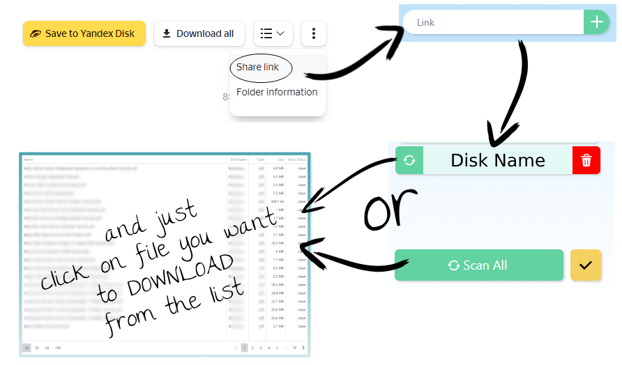
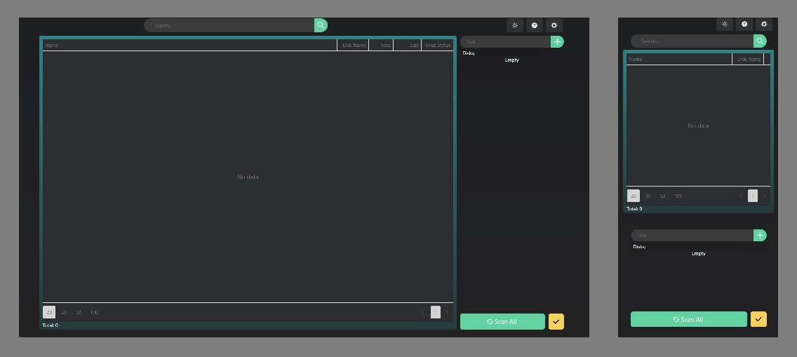

# YadiSearch

> [Live Version](https://yadisearch.netlify.app)

### How to use?

---

### Used Libraries

- [Chakra UI](https://chakra-ui.com/)

- [Devextreme-Datagrid](https://js.devexpress.com/Overview/DataGrid/)

- [Dexie.js](https://dexie.org/) - IndexedDB

### Responsive Design

---

### License

[MIT](https://choosealicense.com/licenses/mit/)
